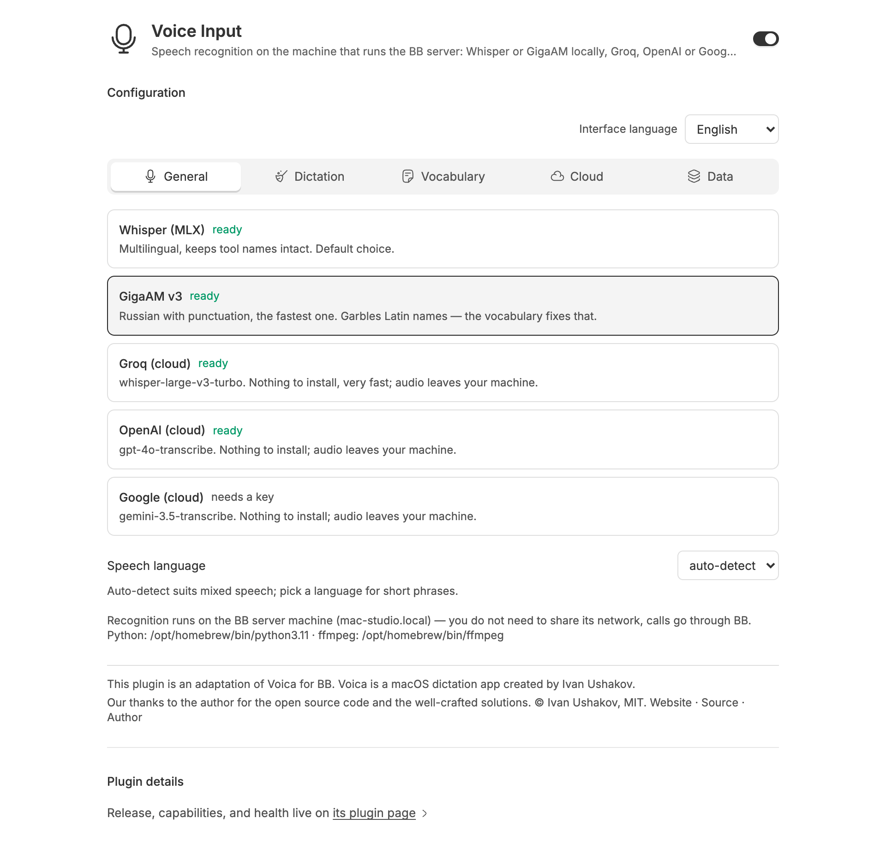
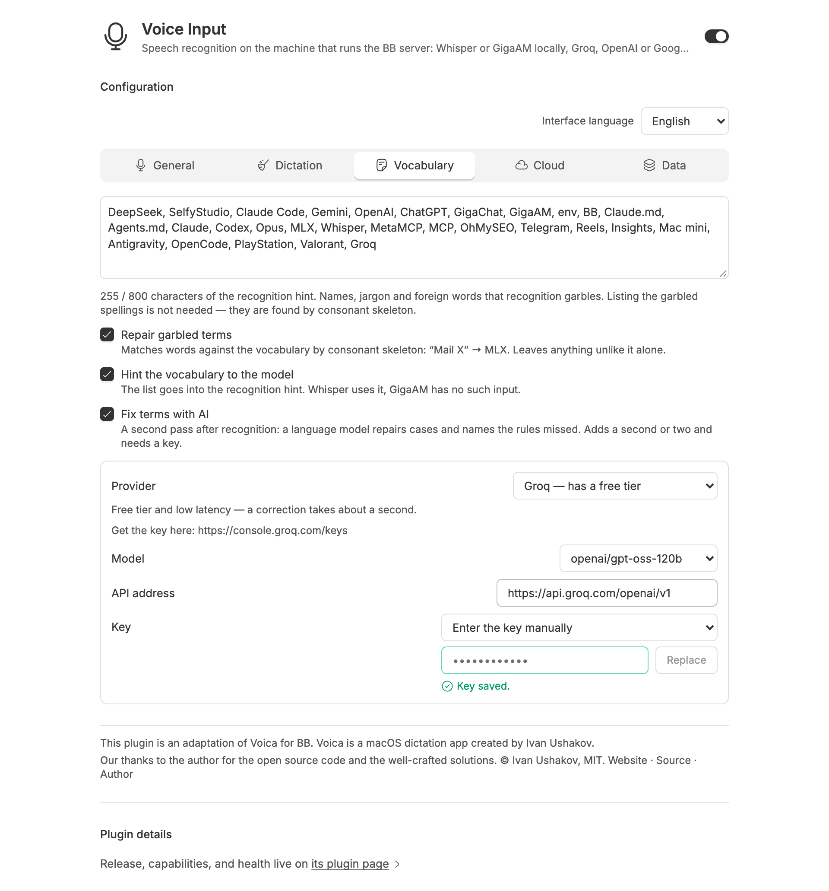
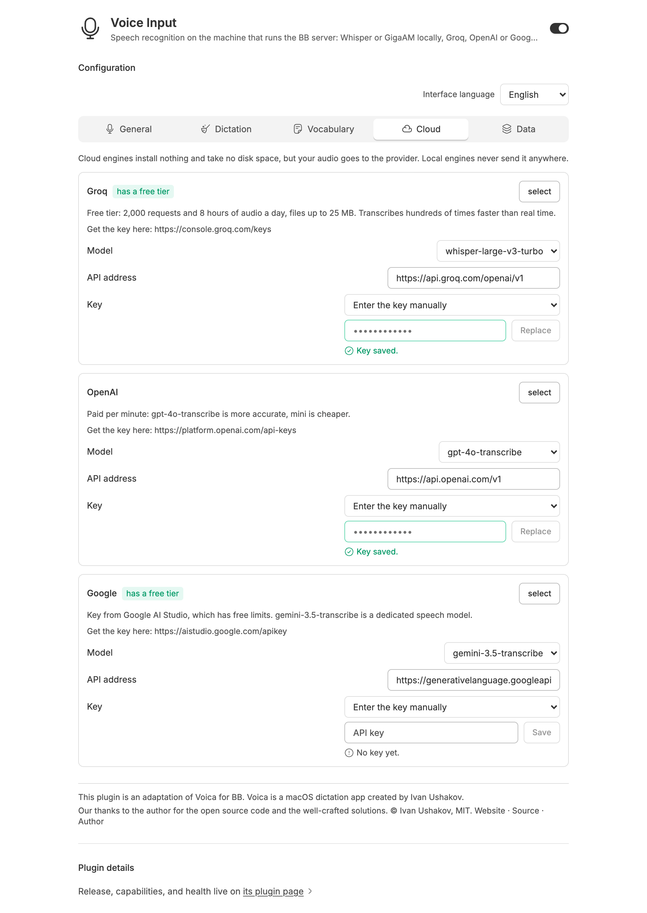
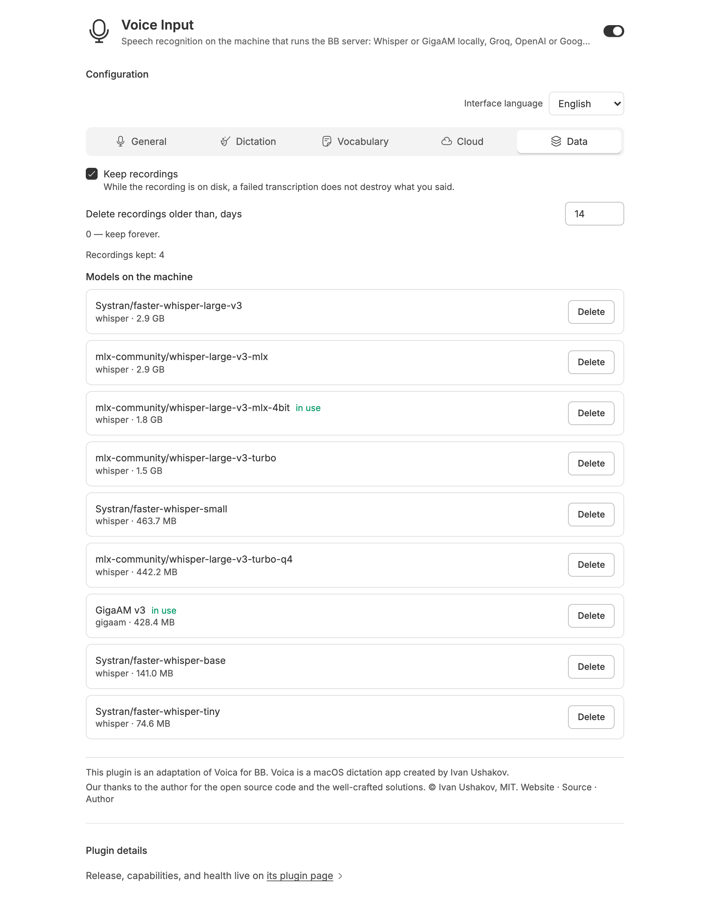

# BB Voice Input (`bb-plugin-voice-input`)

A BB plugin that transcribes voice messages from chat **on the machine running your BB server**, keeping speech private and offline. Adapted from [Voica](https://voica.ru/) for BB. Audio never leaves your server unless a cloud provider is selected, and every recording is saved to disk before transcription — failed recognition never loses what you said.

## Screenshots

| Engines & Speech Language | Vocabulary & AI Correction Pass |
| --- | --- |
|  |  |
| **Cloud Providers & API Keys** | **Recordings & Disk Models** |
|  |  |

## Features

- **Five speech engines:**
  - Local `whisper` via [mlx-whisper](https://github.com/ml-explore/mlx-examples/tree/main/whisper) (optimized for Apple Silicon).
  - Local `gigaam` (GigaAM v3 e2e by Sber, running on MPS/CPU).
  - Cloud `groq` (`whisper-large-v3-turbo` with generous free limits).
  - Cloud `openai` (`gpt-4o-transcribe`).
  - Cloud `google` (`gemini-3.5-transcribe` via Google AI Studio).
- **Continuous multi-tab dictation:**
  - Recording remains active while navigating between threads, opening files, or changing settings.
  - An in-place waveform bar with a real-time audio visualizer replaces the composer buttons during dictation.
  - Automatically returns you to the origin thread when finished, delivering the transcript directly to the draft editor.
- **One-command engine setup:** `bb voice-input setup` installs isolated Python venvs for local models without polluting the system.
- **Term vocabulary:** List names and tech terms. Garbled spellings are repaired by matching consonant skeletons, so "Mail X" becomes MLX and "kladko code" becomes Claude Code without listing every phonetic error.
- **Text cleanup:** Automatically strips filler words (e.g. "uh", "um", "ну", "э-э") and fixes typography/quotes; rules can be toggled per preference.
- **Optional AI correction pass:** A secondary LLM pass (using any OpenAI-compatible endpoint) fixes vocabulary terms the rules missed, and nothing else.
- **Full recording history & disk control:** Configurable retention days, one-click model downloads with live percentage progress, and disk space management.
- **Settings page in 8 languages:** English, Russian, German, French, Spanish, Portuguese, Chinese, and Japanese.

## Setup & Installation

```bash
bb plugin install .
bb settings set BB_TRANSCRIPTION local-voice/default
bb voice-input setup
bb voice-input status
```

### Requirements

- **Local engines (`whisper`, `gigaam`):** Python 3 and `ffmpeg` installed on the host running the BB server.
  - `whisper` requires macOS on Apple Silicon (M1/M2/M3/M4).
- **Cloud engines (`groq`, `openai`, `google`):** Only require an API key entered in plugin settings or via environment variable.

## Cloud Providers & Keys

Cloud providers can be configured directly in the plugin settings UI (Settings → Voice Input → Cloud) or via CLI:

| Provider | Model | Free Tier |
| --- | --- | --- |
| Groq | `whisper-large-v3-turbo` | 2,000 requests & 8 hours of audio per day |
| Google | `gemini-3.5-transcribe` | Standard Google AI Studio rate limits |
| OpenAI | `gpt-4o-transcribe` | Paid per-minute billing |

If the [Env Catalog](https://github.com/VKirill/bb-plugin-env-catalog) plugin is installed, API keys can be selected directly from the catalog. Keys entered manually are stored in a secure `0600` file on the server and are never returned to the frontend.

## How Vocabulary Repair Works

Two layers of protection ensure technical terms and proper nouns are transcribed correctly:

1. **Model Recognition Prompt:** The term list is passed into Whisper prior to transcription as an initial prompt context.
2. **Consonant Skeleton Matching:** Spoken words are compared against vocabulary terms by consonants: vowels are frequently dropped or altered by ASR engines, but consonant skeletons stay intact ("Mail X" → MLX, "Dпсик" → DeepSeek).
3. **AI Correction Pass (Optional):** Anything missed by deterministic rules is processed by a targeted LLM prompt that corrects only vocabulary terms and preserves surrounding sentence structure.

## Engine Benchmarks

Measured on Mac mini M4, Russian speech, warm run (model preloaded in memory):

| Engine | 11s speech | 67s speech | Terms & English names | Native Russian |
| --- | --- | --- | --- | --- |
| `whisper` (large-v3 4-bit) | 2.5s | 4.8s | Accurately matches "Claude Code", "MLX", "MetaMCP" | Digits as numbers |
| `gigaam` (v3 e2e, MPS) | 0.6s | ~4.0s | Phonetic garbles without vocabulary repair | Native punctuation, full numbers as words |

*Whisper large-v3 4-bit is the default model: it processes audio twice as fast as the non-quantized model and does not drop speech segments.*

## Architecture

- BB selects the active speech recognition service via `BB_TRANSCRIPTION` (e.g. `local-voice/default`).
- The plugin registers the `local-voice` service in `server.ts` and implements recognition in the host daemon (`host.ts`).
- Local engines run inside a persistent Python daemon (`python/voiced.py`) communicating over dedicated Unix sockets, keeping models warm in memory.
- Python assets are embedded directly into the host bundle via `scripts/embed-assets.mjs` and materialized into the plugin's host data directory.

## Development

```bash
npm run embed      # Re-embed Python assets after editing python/
npm run typecheck  # TypeScript validation
npm test           # Unit tests
npm run build      # Build server, host, and app bundles
```

## Credits

This plugin is an adaptation of [Voica](https://voica.ru/) for BB, created by Ivan Ushakov (MIT License).
The term vocabulary repair algorithm, AI correction prompts, and text cleanup heuristics originate from Voica.

- Website: [https://voica.ru/](https://voica.ru/)
- Source: [https://github.com/Inhum/voica](https://github.com/Inhum/voica)
- Author: [https://github.com/Inhum](https://github.com/Inhum)

## License

MIT License. Portions adapted from Voica are © Ivan Ushakov (MIT License).
